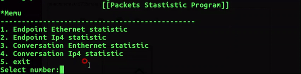

# *pcap_stat_program*
### Table of Contents

* [About the Project](#about-the-project)
  * [Introduction](#introduction)
  * [Demo](#introduction)

* [Getting Started](#getting-started)
  - [Installation](#installation)
* [Usage](#usage)
* [Reference](#reference)

### About the Project

#### Introduction

> This Program is implements packets statistic using pcap.h.

#### Demo

>  Statustucs of Endpoint(ethernet, ipv4) and Conversation (ethernet, ipv4) 



### Getting Started

#### Installation

0. OS : Ubuntu
1. Install pcap library.

```sh
$ sudo apt-get install libpcap-dev
```

### Usage

```sh
$ pcap_stat_dep test.pcapng
```

### Reference

> This is a description of Function.